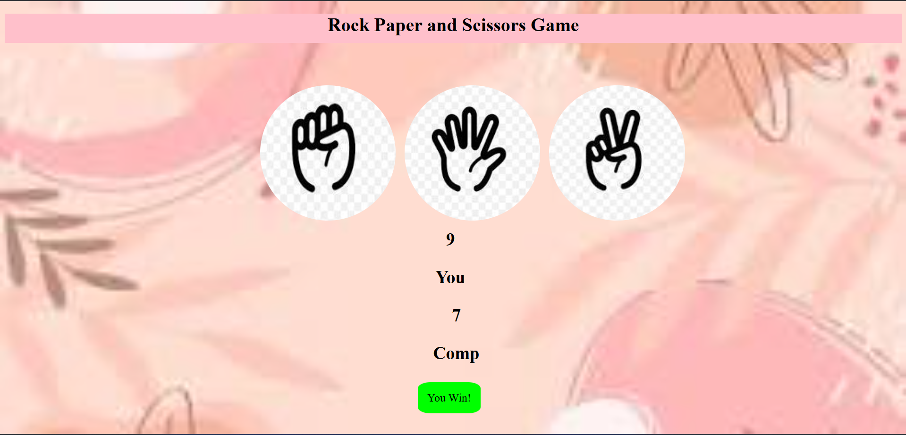

🪨📄✂️ Rock Paper Scissors Game

A simple, colorful Rock Paper Scissors game built using HTML, CSS, and JavaScript. Play against the computer by choosing one of the three options: Stone, Paper, or Scissor. The game updates scores in real time and shows who wins each round!
🎮 Features

🎨 Colorful and clean user interface

🖱 Three clickable choices: Stone, Paper, Scissor

🤖 Computer randomly selects its choice

🔢 Score counter for both player and computer

🏆 Displays winner of each round

🔁 Play as many rounds as you like

🚀 How to Run

Download or Clone this repository:

git clone https://github.com/yourusername/rock-paper-scissors.git

Open the index.html file in your browser:

You can double-click it

Or use a local server for best results (e.g., VSCode Live Server)

🧱 Tech Stack

HTML – Structure

CSS – Styling

JavaScript – Game logic and interactivity

📁 File Structure
rock-paper-scissors/
├── index.html        # Main HTML file
├── style.css         # Styles for the game
└── script.js         # Game logic

📸 Preview

Soumya Jain

GitHub: @yourusername
